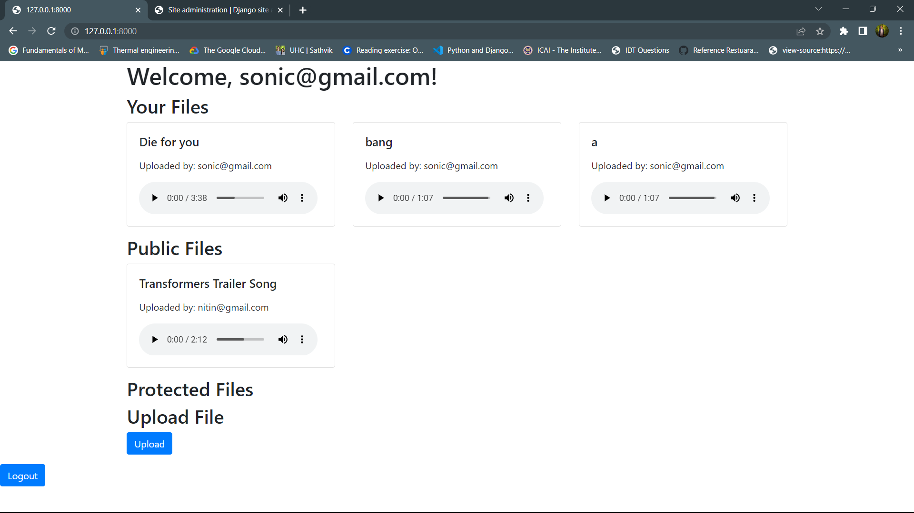

# Music Sharing Web App

## Description

This is a web application built with Django that allows users to share and listen to music files.

## Features

- User registration and authentication
- Upload and share music files
- Different access levels for files (public, protected, private)
- Customizable allowed email addresses for protected files
- User-specific and public file listings
- Responsive design using Bootstrap

## Sample OutPut Images

#### This is the output for one of the user i've registered in the registration page.



- As Visible Sonic is not able to view protected files because he doesn't have acess to it.


    - In this screenshot the user nitin is able to view the protected files because he has access to it.

```

```

## Bugs and Problems

This website is still under developement and has a lot of bugs.

- Firstly it is necessary to login in to the admin.
- Once logged into the admin, then open the homepage, and login or register.
- This is the major bug which needs to updated and debugged.
- If you're not logged into the django admin, even if the user is registered the login page reloads.
